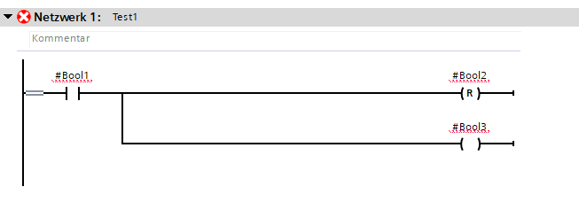
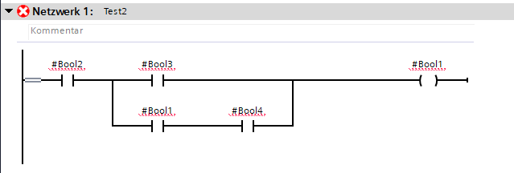

# TiaCodeGen
Library to Generate TIA KOP Code via C#

# Samples

```csharp
            var codeblock = new CodeBlock();
            var nw = new Network("Test1");

            nw.Add(
                new And(
                    new Signal("#Bool1"),
                new Distributor
                (
                    new RCoil(new Signal("#Bool2")),
                    new Coil(new Signal("#Bool3"))
                )));

            codeblock.Add(nw);

            var block = new Block("Test", "blabla", codeblock);
            block.Interface = TestInterface;
            var xml = block.GetCode();
```

This will create following



```csharp
            var codeblock = new CodeBlock();
            var nw = new Network("Test1");

            nw.Add(
                new And(
                    new Signal("#Bool1"),
                new Distributor
                (
                    new RCoil(new Signal("#Bool2")),
                    new Coil(new Signal("#Bool3"))
                )));

            codeblock.Add(nw);

            var block = new Block("Test", "blabla", codeblock);
            block.Interface = TestInterface;
            var xml = block.GetCode();
```

This will create following

image is missing....


```csharp
            var codeblock = new CodeBlock();
            var nw = new Network("Test1");

            code is missing....
            
```

This will create following


```csharp
            var codeblock = new CodeBlock();

            var nw = new Network("Test2");
            nw.Add(
                new Coil(
                    new Signal("#Bool1"),
                    new And(
                        new Signal("#Bool2"),
                        new Or(
                             new Signal("#Bool3"),
                             new And(
                                new Signal("#Bool1"),
                                new Signal("#Bool4")
                            )
                        )
                    )
                )
            );

            codeblock.Add(nw);

            var block = new Block("Test", "blabla", codeblock);
            block.Interface = TestInterface;
            var xml = block.GetCode();
```

This will create following


